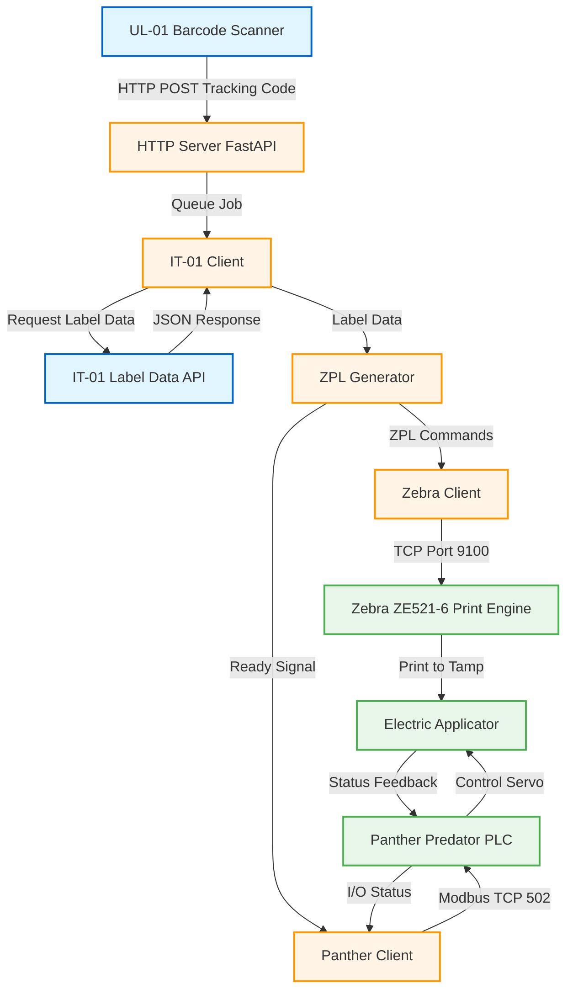

# UPS Label Printing System - Architecture Diagram

## System Overview

This diagram shows the main components of the UPS label printing system and their communication paths.



---

## Component Details

### External Systems (Blue)
- **UL-01**: Vision system that reads barcodes from boxes and triggers label printing
- **IT-01**: Backend service that provides label rendering data for each tracking code

### Python Controller (Orange)
- **HTTP Server**: Receives barcode events from UL-01
- **IT-01 Client**: Fetches label data from IT-01 API
- **ZPL Generator**: Transforms JSON data into Zebra Programming Language
- **Zebra Client**: Sends ZPL to print engine via TCP socket
- **Panther Client**: Controls applicator via Modbus TCP or EtherNet/IP

### Print & Apply Hardware (Green)
- **Zebra ZE521-6**: Industrial print engine (6" width, 203 DPI)
- **Panther Predator**: PLC-based controller for the applicator system
- **Electric Applicator**: Servo-driven tamp mechanism (48" stroke)

---

## Communication Protocols

| Connection | Protocol | Port/Method | Data Format |
|------------|----------|-------------|-------------|
| UL-01 → Python | HTTP POST | Port 8000 | JSON (tracking code) |
| Python → IT-01 | HTTP GET/POST | Variable | JSON (label request) |
| IT-01 → Python | HTTP Response | Variable | JSON (label data) |
| Python → Zebra | Raw TCP | Port 9100 | ZPL (print commands) |
| Python → Panther | Modbus TCP | Port 502 | Binary I/O (triggers/status) |
| Python → Panther | EtherNet/IP | Variable | Binary I/O (alternative) |

---

## Data Flow Summary

1. **Barcode Scan**: UL-01 scans box → sends tracking code to Python service
2. **Fetch Label Data**: Python requests label info from IT-01 → receives JSON
3. **Generate Print Format**: Python converts JSON to ZPL commands
4. **Print Label**: Python sends ZPL to Zebra → label prints to tamp pad
5. **Apply Label**: Python triggers Panther → applicator stamps label on box
6. **Monitor Status**: Panther reports cycle complete → Python logs success

---

## Network Configuration

```
┌─────────────────────────────────────────────────────────────┐
│                    Network Subnet (Example)                  │
│                     192.168.1.0/24                          │
├─────────────────────────────────────────────────────────────┤
│                                                              │
│  Python Service        Zebra Print Engine    Panther PLC    │
│  192.168.1.50:8000    192.168.1.100:9100    192.168.1.101:502│
│                                                              │
│  External: IT-01 Service                                    │
│  (URL: http://it01.example.com or internal IP)             │
└─────────────────────────────────────────────────────────────┘
```

---

## Key Design Principles

1. **Separation of Concerns**:
   - Print data (ZPL) goes directly to Zebra print engine
   - Control signals go to Panther PLC
   - Python service orchestrates but doesn't block data flow

2. **Standard Protocols**:
   - HTTP for business logic (UL-01, IT-01)
   - TCP/ZPL for printing (industry standard)
   - Modbus TCP for industrial control (widely supported)

3. **Async Operation**:
   - Python service queues jobs
   - Non-blocking I/O for all network operations
   - Real-time status monitoring via Panther I/O

4. **Error Recovery**:
   - Panther reports errors via I/O status
   - Python can retry, reset, or bypass as needed
   - Built-in diagnostics on Panther 7" touchscreen
